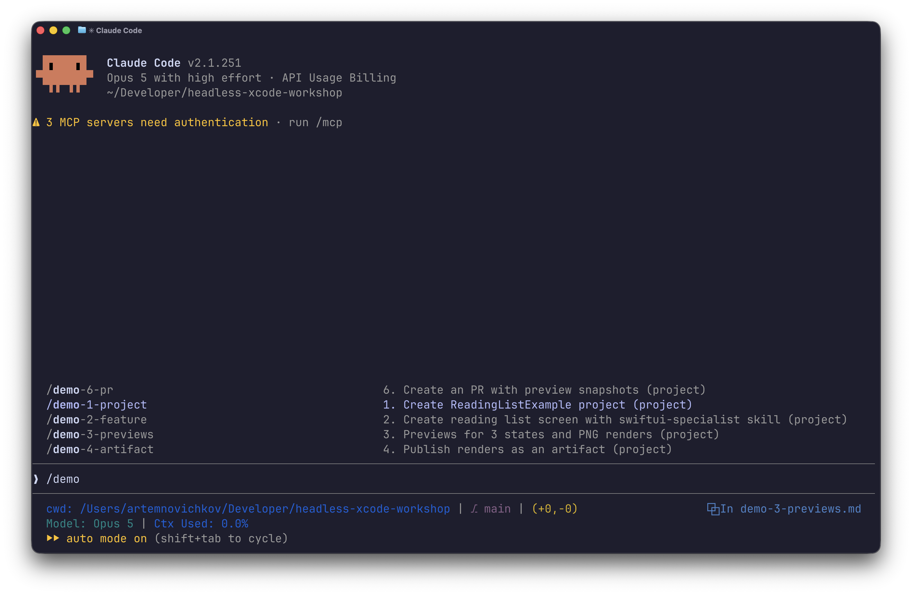

# Headless Xcode Workshop

A template repo for a hands-on workshop: building an iOS app with Claude Code, without touching the Xcode UI. Project creation, feature work, previews, simulator runs and the PR all happen from the terminal.



## What's inside

`.claude/commands/` — six `/demo-*` slash commands, the workshop script step by step. That's it.

The Xcode MCP server and Apple's skills are **not** committed — you add them in setup below, straight from your local Xcode.

## Requirements

- macOS with **Xcode 27** or newer (it ships `xcrun mcpbridge` and the skills) and an iOS simulator installed
- [Claude Code](https://claude.com/claude-code) `v2.1` or newer
- [GitHub CLI](https://cli.github.com) (`gh`), authenticated — needed for the last step

## Setup

1. Click **Use this template** on GitHub, then clone your copy and `cd` into it.

2. Make sure the right Xcode is active, then enable and start its MCP server:

   ```sh
   xcode-select -p                 # should point at the Xcode you want (e.g. Xcode-beta.app)
   sudo xcrun mcp-server enable    # one-time, asks for your password
   xcrun mcp-server start
   xcrun mcp-server status         # Permission: enabled / mcp-server: running
   ```

   Switch Xcode with `sudo xcode-select -s /Applications/Xcode-beta.app` if the path is wrong.

3. Register the server with Claude Code — build, run, render previews, drive the simulator:

   ```sh
   claude mcp add --scope project xcode -- xcrun mcpbridge
   ```

   This writes `.mcp.json` in the repo root.

4. Export Apple's official Swift/SwiftUI skills from Xcode (SwiftUI, App Intents, testing, UIKit modernization, security audit — 10 in total):

   ```sh
   xcrun agent skills export --output-dir .claude/skills
   ```

   First run launches Xcode to pull them out; it takes a moment.

5. Run `claude`, approve the `xcode` MCP server when prompted (`/mcp` shows its status), then type `/demo` and pick the first step.

## The workshop script

Run the commands in order — each builds on the previous one.

| Command | What it does |
| --- | --- |
| `/demo-1-project` | Creates the `ReadingListExample` SwiftUI app and builds it for iOS |
| `/demo-2-feature` | Builds the reading list feature (model, `@Observable` store, list + detail + add sheet, `OSLog`) using the `swiftui-specialist` skill |
| `/demo-3-previews` | Adds `#Preview`s for the loading/loaded/failed states and renders them to PNG |
| `/demo-4-artifact` | Publishes the renders as an artifact — one card per state |
| `/demo-5-simulator` | Runs on the iPhone 17 Pro simulator and verifies the flows via UI interaction |
| `/demo-6-pr` | Opens a PR with the preview snapshots embedded in the description |

## Making it your own

- **Different app?** Edit the prompts in `.claude/commands/*.md`. Each file is frontmatter (`description:`, shown in the `/` menu) plus the prompt body.
- **Add a step?** Drop a new `.md` file into `.claude/commands/`; the filename becomes the command name.
- **Different simulator?** Change the device name in `demo-5-simulator.md`.
- **Fresh start?** Delete the generated `ReadingListExample/` folder and re-run `/demo-1-project`.
- **Skills out of date?** Re-run the export — a newer Xcode ships newer skills.

## Notes

- The generated project lives in a subfolder of this repo, so the demo commands and the app share one git history.
- `/demo-4-artifact` needs an account with artifacts enabled; skip it if publishing is unavailable.

## Author

Artem Novichkov, https://artemnovichkov.com